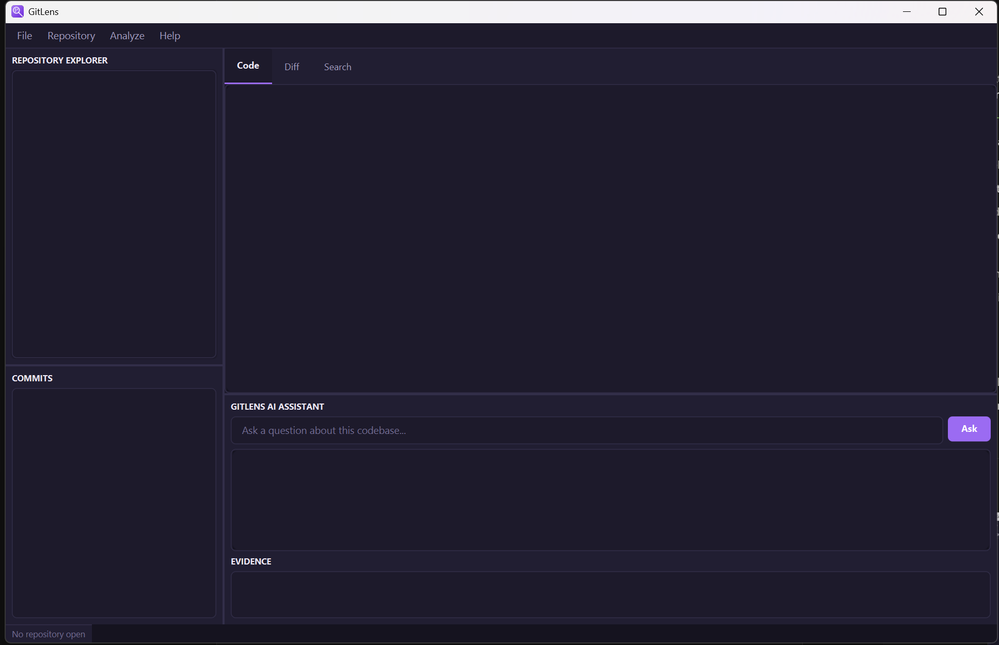

<div align="center">


# GitLens

**A JavaFX desktop app that explains *why* your code exists — not just what it does.**

[](https://github.com/zenoxart/GitLens/actions/workflows/build.yml)
[](LICENSE)


</div>

<br />

<div align="center">
  
</div>

<br />

## Start here

Every codebase can tell you *what* a function does — the code is right there. What it can't tell you is *why* it exists: which incident caused that retry loop, which PR introduced that validation rule, which discussion settled on that timeout value. That history is scattered across commit messages, pull requests, and issue threads, and normally you go digging for it by hand.

GitLens digs for you, first — then explains.

It never lets an LLM guess at your project's history. Every question goes through a strict two-step pipeline:

```
1. RETRIEVE   Git log/diff/blame (JGit) + GitHub PRs & issues + a local Lucene index
                        ↓
2. EXPLAIN    The retrieved evidence — and only that evidence — is handed to the LLM,
              which is instructed to answer using nothing else and to cite its sources
```

Ask *"why does this retry three times?"* and GitLens doesn't hallucinate a plausible-sounding story — it finds the commit, resolves it to the pull request, resolves that to the issue that prompted it, and hands the model exactly those three things. The answer comes back with the evidence attached, and every piece of evidence is clickable: click a commit and the commit viewer opens, click a file and the source opens.

No server, no database. Your Git repository *is* the database. A hidden `.code-history/` folder in the repo just caches a Lucene index and GitHub data — delete it any time and GitLens rebuilds it from Git and GitHub alone.

## Features

| | |
|---|---|
| ✅ | Open a local repository, or clone one from a URL |
| ✅ | Repository file explorer (lazy-loaded tree) |
| ✅ | Commit history with a full diff viewer |
| ✅ | Full-text search (Apache Lucene) across commit messages and file paths |
| ✅ | AI assistant panel — evidence-backed answers with clickable citations |
| ✅ | Modern dark UI, purple accent, native window icon |
| 🧩 | GitHub pull request / issue fetching — implemented, not yet wired into the UI |
| 🧩 | Java symbol extraction (JavaParser) — implemented, not yet wired into the UI |
| 🗺️ | Dependency graph view, developer-expertise scoring, method-level history |

✅ working today · 🧩 built but not surfaced in the UI yet · 🗺️ planned

## Architecture

```
                       JavaFX UI  (Repository Explorer · Commits · Diff · Search · AI Assistant)
                                        │
                     ┌──────────────────┼──────────────────┐
                     │        service/  orchestration        │
                     └──────────────────┼──────────────────┘
           ┌──────────┬──────────┬──────┴──────┬──────────┬──────────┐
           │          │          │             │          │          │
         git/      github/    search/      analysis/     ai/     storage/
        (JGit)    (GitHub    (Lucene)   (JavaParser)  (LLM call  (.code-history
                    REST)                              + prompt)   JSON cache)
```

The Java application always retrieves evidence itself before ever calling the LLM — the model explains, it never searches on its own.

## Download

Every push to `main` builds a runnable jar for Windows, macOS, and Linux via [GitHub Actions](https://github.com/zenoxart/GitLens/actions/workflows/build.yml):

1. Open the [**Actions**](https://github.com/zenoxart/GitLens/actions/workflows/build.yml) tab and pick the latest successful run.
2. Download the artifact for your platform (`gitlens-windows`, `gitlens-macos`, or `gitlens-linux`) — it's a zip containing one jar.
3. Run it with a JDK 21+ on your `PATH`:

```bash
java -jar gitlens-win.jar
```

## Getting started (build from source)

**Prerequisites:** JDK 21+. That's it — the Maven wrapper (`mvnw` / `mvnw.cmd`) downloads everything else, including the right JavaFX platform jars for your OS.

```bash
git clone https://github.com/zenoxart/GitLens.git
cd GitLens
```

Run it directly:

```bash
./mvnw javafx:run
```

On Windows use `mvnw.cmd javafx:run` instead.

Or build a standalone runnable jar (the same one CI produces):

```bash
./mvnw -Pdist package
java -jar target/gitlens-*.jar
```

Then in the app: **File → Open Repository** and point it at any local Git repository.

## Configuration

| Variable | Purpose |
|---|---|
| `ANTHROPIC_API_KEY` | Enables the AI Assistant panel. Without it, GitLens still retrieves and displays evidence, but answers come back as "AI answers are not configured" instead of an LLM-generated explanation. |

GitHub enrichment (pull requests, issues) is implemented in `github/` and `service/GitHubService.java` but not yet wired to a settings screen — see [Features](#features).

## Project structure

```
src/main/java/com/codehistorian/
    Main.java, Launcher.java     entry points (Launcher exists so the shaded jar can run without --module-path)
    ui/          MainController.java — wires the FXML view to the services below
    service/     RepositoryService, GitHistoryService, GitHubService, SearchService,
                 QuestionService, EvidenceService, CodeAnalysisService
    model/       plain data classes (CommitInfo, PullRequestInfo, IssueInfo, Evidence, ...)
    git/         JGit integration — reading repos, commits, diffs, blame
    github/      GitHub REST client — pull request & issue fetchers
    search/      Apache Lucene index, indexer, search engine
    analysis/    JavaParser-based symbol & dependency extraction
    ai/          LLM client, prompt builder, answer generator
    storage/     JSON cache + the .code-history/ project folder layout

src/main/resources/
    fxml/main.fxml     the UI layout
    css/modern.css      dark theme, purple primary color
    icons/              app icon (multiple sizes + .ico)
```

## Local storage

GitLens keeps a hidden folder inside the repository you open:

```
.code-history/
    repository.json
    github/{pull-requests,issues}/
    index/lucene/
    symbols/symbols.json
    dependencies/graph.json
    cache/
```

It's pure cache. Delete it and GitLens reconstructs everything from Git and GitHub the next time you open the repository.

## Tech stack

Java 21 · JavaFX 21 · JGit · Apache Lucene · Jackson · JavaParser · GitHub REST API · Anthropic API

## License

[MIT](LICENSE)
